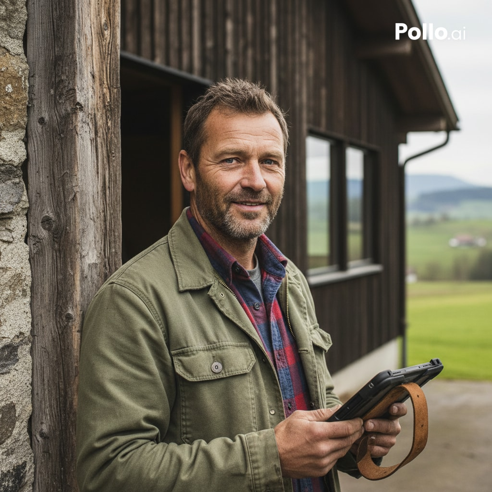
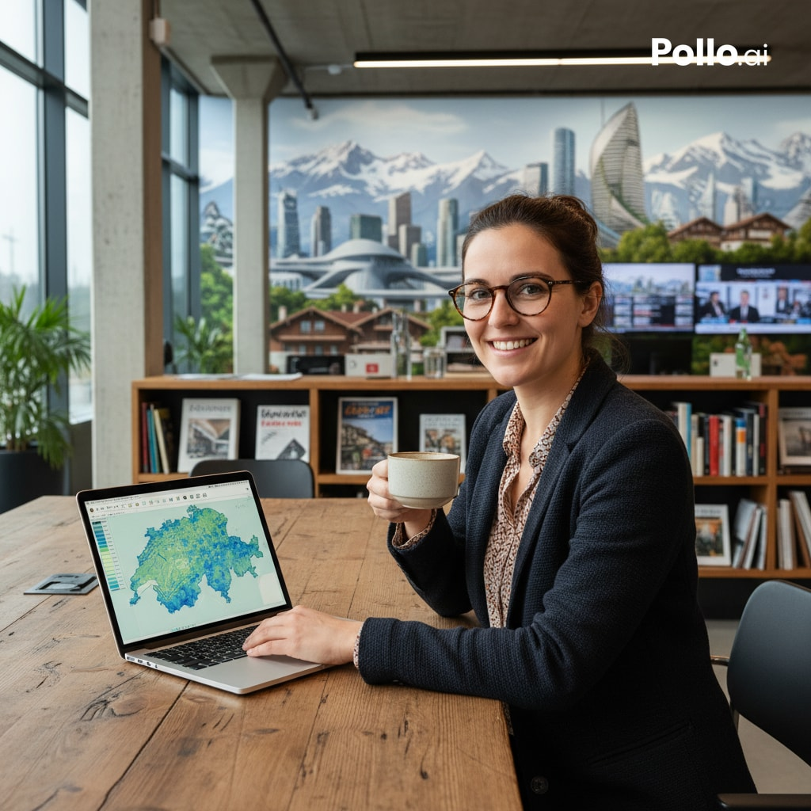

# Project Charta
## Context and Scope
<!-- Describe the context (domain/business area) and topic of the visualization project. Which topical aspects should be addressed? Which question(s) should the data visualization project answer? What are the expected benefits of the project? Where should the visualization product be published (e.g. website, app, intranet)? -->

**Domain:** Agriculture & Open Data (Thurgau, Switzerland).

**Topic:** Visualization of livestock populations (cattle, pigs, ...) per municipality.

**Key Questions:** How is livestock geographically distributed across the canton?

**Expected Benefits:** Improved transparency regarding agriculture for citizens, planners, and regional analysts.

**Publication:** Publicly accessible web-based dashboard via GitHub Pages.

## Project Objectives and Success Criteria
<!-- Describe the objectives **from the client/stakeholder perspective**. For example: "Enable users to understand the distribution of sales across different regions". Try to be as specific as possible, but restrict to the concrete needs formulated by the client/stakeholders. For example: if a dashboard is needed explicitly, then state it here, otherwise leave the form of the visualization product open. -->

- Create an interactive map of Canton Thurgau representing livestock data.
- Enable users to compare populations between municipalities intuitively.

<!-- Formulate success criteria (from the client/stakeholder perspective): qualitative objectives and, wherever possible, corresponding quantitative metrics with target values to be achieved within the project. These objectives should directly address the pains and gains identified in the user analysis. -->

### Success Criteria:
**Qualitative:** Users can identify high-density regions within 5 seconds of interaction.

**Quantitative:** 100% of Thurgau's 80 municipalities correctly mapped and labeled.

<!-- It is also helpful to specify what is explicitly excluded from the project objectives (out of scope). -->

- Historical trend analysis (focus is on the most recent dataset)

## Stakeholder Analysis
<!-- List the people involved in and affected by the project. Describe their goals and relationships with each other. Visualisation in the form of a stakeholder map can provide a quick overview. -->

**Project Team:** Responsible for data processing, design, and technical implementation.

**Project Coaches:** Providing guidance, feedback, and final assessment.

**Canton Thurgau:** Primary data provider.

**General Public:** End-users interested in regional agricultural distribution.

## User Analysis
 
The target users of this visualization range from domain experts with deep agricultural knowledge to casual users seeking quick data-driven insights. Two representative personas were developed to guide design decisions.
 
### Persona 1: "Lukas, the Farmer" (Domain Expert)

{#pic-Lukas}
 
- Domain Expertise: Very high (extensive practical knowledge of livestock farming).
- Data Literacy: Moderate (understands statistics but is not a data analyst). According to a study published in Agrarforschung Schweiz, digital tools in Swiss agriculture are primarily used to reduce physical labor, while data-driven management tools still see low adoption [1].
- Technical Environment: Desktop PC in the office or a tablet in the barn.
- Frequency of Use: Occasional (e.g., for local positioning or preparing for association meetings).
 
**User Tasks (Jobs):**
 
- Functional: Comparing the livestock density of his own municipality with neighboring regions in the canton.
- Social: Creating a factual basis for discussions with colleagues or the farmers' association, drawing on official cantonal data [2].
- Emotional: Feeling confident and objectively informed about regional agricultural developments.
 
**Pains:**
 
- Having to sift through dry PDF reports from the canton just to find a single figure. A survey by Opendata.ch (2022) found that 27% of OGD users demand better data previews and 35% better search functions [3].
- Frustration with outdated or cluttered websites that are difficult to navigate.
- Difficulty visualizing the spatial distribution of abstract numbers.
 
**Gains:**
 
- A simple interface that immediately visualizes the "Top 3 municipalities."
- Instant clarity on the distribution of different livestock categories (e.g., cattle vs. pigs).
- A modern, responsive tool that he can showcase on his tablet while on the move.
 
---
 
### Persona 2: "Julia, the Journalist" (Casual User)

{#pic-Julia}
 
- Domain Expertise: Low to moderate (searching for trends, outliers, and anomalies).
- Data Literacy: High (experienced in interpreting graphics for news articles). The SRF Data Team exemplifies how Swiss data journalists combine open data with interactive visualizations for investigative reporting [4].
- Technical Environment: Laptop (large screen) and smartphone.
- Frequency of Use: One-time intensive use during a specific research phase.
 
**User Tasks (Jobs):**
 
- Functional: Identifying "hotspots" (outliers) with extremely high livestock density for an investigative report.
- Social: Communicating data-driven facts to readers (Data Journalism).
- Emotional: Gaining certainty that the cited figures originate from a reliable source (Open Data Kanton Thurgau) [5].
 
**Pains:**
 
- Time pressure: No time to manually plot raw data in Excel or specialized software.
- Risk of misinterpretation when using purely tabular data without geographic context.
- Static maps that offer no detailed information (tooltips) for smaller municipalities.
 
**Gains:**
 
- An interactive map that can easily be screenshotted or linked for an article.
- Filtering functions to quickly switch between different datasets or animal types.
- Transparent source citations integrated directly into the visualization.
 
---
 
### Sources
 
| # | Source | Relevance | Link |
|---|--------|-----------|------|
| 1 | **Agrarforschung Schweiz (2020)** – Charta zur Digitalisierung | Persona 1: supports "moderate data literacy" — documents low adoption of data-driven tools among Swiss farmers | [agrarforschungschweiz.ch](https://www.agrarforschungschweiz.ch/2020/05/charta-zur-digitalisierung-gemeinsam-zu-tragfaehigen-loesungen/) |
| 2 | **Agristat / SBV** – Statistik der Schweizer Landwirtschaft | Persona 1: official agricultural statistics as the factual basis Lukas would use in association meetings | [sbv-usp.ch/agristat](https://www.sbv-usp.ch/de/services/agristat-statistik-der-schweizer-landwirtschaft/) |
| 3 | **Opendata.ch – OGD User Survey (2022)** | Persona 1 + 2: supports "pains" — 35% demand better search, 27% better previews/visualizations on OGD portals | [opendata.ch](https://opendata.ch/news/opendata-swiss-empfehlungen-auf-basis-der-umfrageergebnisse/) |
| 4 | **SRF Data (GitHub)** | Persona 2: Swiss data journalism reference — demonstrates how journalists use open data for interactive visualizations | [srfdata.github.io](https://srfdata.github.io/) |
| 5 | **Open Data Kanton Thurgau – Landwirtschaftliche Tierbestände** | Both personas + Situation Assessment: primary dataset (livestock per municipality from 2015, Landwirtschaftsamt TG) | [data.tg.ch](https://data.tg.ch/explore/dataset/div-la-2/) |
| 6 | **swiss-maps (npm / GitHub)** | Situation Assessment: pre-built TopoJSON of Swiss municipalities for D3.js | [github.com/interactivethings/swiss-maps](https://github.com/interactivethings/swiss-maps) |
| 7 | **swisstopo – swissBOUNDARIES3D** | Situation Assessment: official municipality boundaries, updated annually | [swisstopo.admin.ch](https://www.swisstopo.admin.ch/de/landschaftsmodell-swissboundaries3d) |

## Situation Assessment
<!-- Describe the available resources (data, personnel, material, software/tools, infrastructure, etc.) and time as well as restrictions and constraints. Possible risks that may arise during the project are also identified. -->

**Resources:** Data from data.tg.ch, GeoJSON/TopoJSON boundaries, D3.js or Leaflet, GitHub hosting.

**Constraints:** Fixed deadline, must be web-based, requires merging two separate datasets (Geo + Stats).

**Risks:** Potential naming mismatches between the livestock dataset and the GeoJSON municipality IDs

## Visualization Concept
<!-- Translate the project objectives into a concrete visualization concept. This corresponds to the value map side of the Value Proposition Canvas [@Osterwalder2014] – describe how the proposed visualization product addresses the users' tasks, relieves their pains and creates gains. Address the following aspects:

* **Product form**: Composition of the visualization product – dashboard, data story, infographic, exploratory tool, etc.
* **Visual encodings**: Types of charts and visualizations to be used – e.g. bar chart, line chart, scatter plot, map, etc.
* **Interactivity**: Static vs. dynamic/interactive elements – filtering, drill-down, tooltips, linked views, etc.
* **Narrative and annotation**: Text elements, storytelling structure, annotations and contextual information.
* **Target medium and integration**: Embedding in the target environment – e.g. website, intranet, app, print, etc.

For each design decision, articulate the intended value along three dimensions:

* **Cognitive and analytical value**: How does the design amplify the user's ability to detect patterns, identify outliers, understand distributions or discover relationships [@card1999; @vanwijk2005]?
* **Communicative value**: How does the design support the communication of information to the target audience profile(s)? 
* **Experiential and aesthetic value**: How do the visual and interactive qualities of the design foster engagement, trust and willingness to adopt the product in practice?

Justify the concept by mapping it explicitly to the project objectives and the user needs identified in the user analysis. -->

### Product Form
The product will be an interactive exploratory map tool. Unlike a static infographic, users can only access information thats important to them.

### Visual Encodings
- **Choropleth Map:** The primary visualization will be a geographic map of Thurgau where each municipality is color-coded.

- **Color Ramp:** A color scale will represent the density or total count of livestock.

### Interactivity
- **Hover Tooltips:** Moving the mouse over a municipality triggers a popup showing the exact livestock count, the municipality name, and its rank within the canton.

- **Dynamic Filtering:** A UI toggle/dropdown to switch between different animal categories ("All Livestock", "Cattle").

### Narrative and Annotation

- **Contextual Header:** A brief introduction explaining the data source (Open Data Thurgau) and the year the data was collected.

- **Legend:** A clear, labeled color bar to help users translate colors into numerical ranges.

### Target Medium and Integration
 
The visualization will be deployed as a static single-page web application hosted on GitHub Pages. The primary target device is a desktop browser (minimum viewport width: 1024px), with responsive scaling for tablets. The technology stack consists of D3.js for the choropleth rendering, HTML/CSS/JavaScript without a framework dependency, and TopoJSON for lightweight geodata delivery. No server-side backend is required — all data is bundled as static JSON/CSV files within the repository. The GitHub Pages URL will serve as the permanent public link for submission and presentation.


## Project Plan
Divide the project into individual phases, describe them briefly and draw up a preliminary timetable, e.g. as a Gantt chart:

```{mermaid}
%%| label: fig-project-plan
%%| fig-cap: Preliminary project plan in the form of a Gantt chart.
gantt
    title Project Plan: Livestock TG
    dateFormat YYYY-MM-DD
    tickInterval 1week
    tickInterval 1week
    section Project Understanding
        Initiation workshop and context analysis     :a1, 2026-03-17, 1d
        Stakeholder and user analysis     :a3, 2026-03-17, 1d
        Situation assessment    :a4, 2026-03-18, 1d
        Project objectives and visualization concept    :a5, 2026-03-19, 1d
        Sign project charta: milestone, m1, 2026-03-20, 1d
    
    section Data Acquisition and Exploration
        Acquire data :a6, 2026-03-20, 3d
        Exploratory data analysis   :a7, 2026-03-23, 7d
        Discuss data report: milestone, m2, 2026-03-30, 1d
        
    section Visual Encoding and Design
        Overview charts   :a8, 2026-04-01, 7d
        Maps :a9, 2026-04-08, 7d
        Implement Dashboard prototype :a10, 2026-04-15, 14d
        Complete visualization report :a10, 2026-04-29, 14d
    section Evaluation
        Prepare presentation :a10, 2026-05-14, 14d
        Project presentation : milestone, m2, 2026-06-01, 4m
```

<!-- See [Mermaid syntax for Gantt charts](https://mermaid.js.org/syntax/gantt.html). It might not be displayed correctly in Safari &#8594; use Chrome. [Live editor with export functionality](https://mermaid.live/) -->

## Roles and Contact Details
 
| Name | Role | Responsibilities | Contact |
|---|---|---|---|
| Tim Badertscher | Project Lead | Project coordination, timeline management, documentation | badertim@students.zhaw.ch |
| Christian Haag | Data Lead | Explorative Data Analysis, Data Merging | haagchr1@students.zhaw.ch |
| Nikola Kroucil | Visualisation Lead | Dashboard Design | kroucnik@students.zhaw.ch |
 
**Project Coaches:**
 
| Name | Role | Contact |
|---|---|---|
| Manuel Dömer | Coach |doem@zhaw.ch|
| Wibke Weber | Coach |webw@zhaw.ch|

