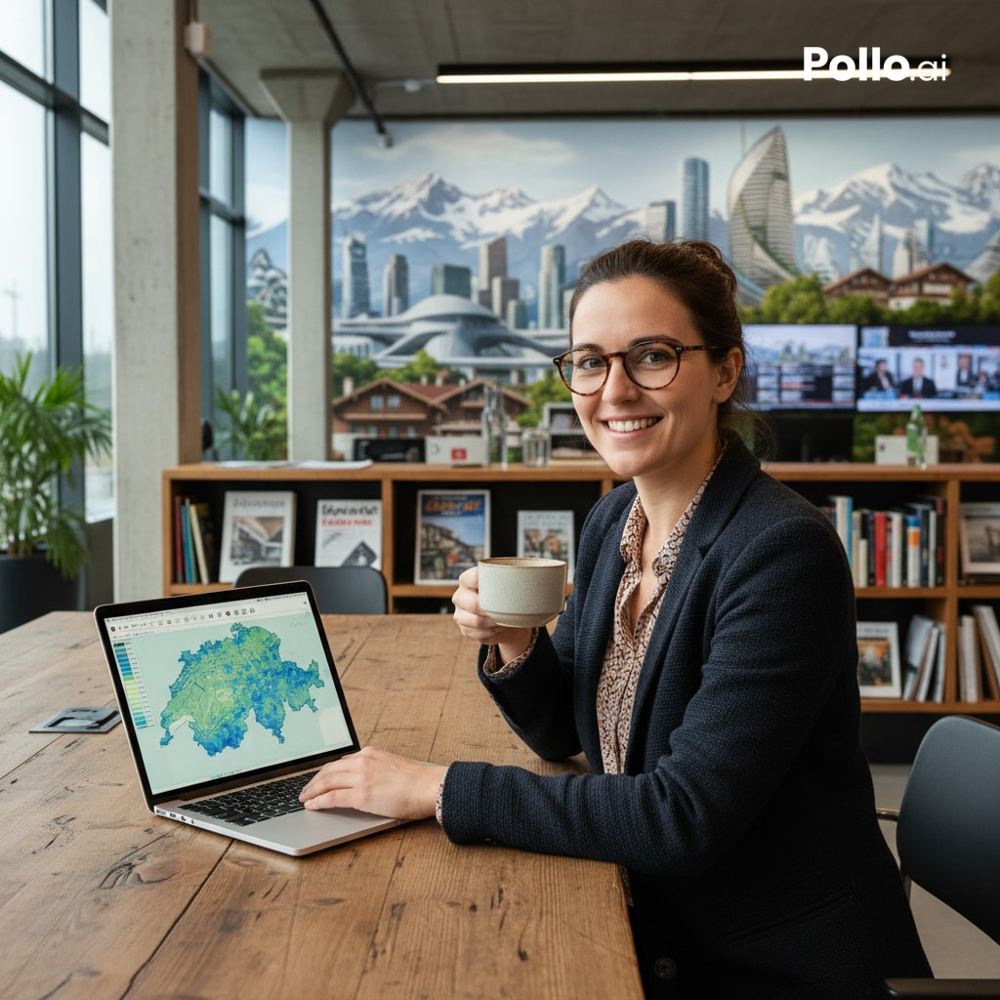

# Project Charta
## Context and Scope
<!-- Describe the context (domain/business area) and topic of the visualization project. Which topical aspects should be addressed? Which question(s) should the data visualization project answer? What are the expected benefits of the project? Where should the visualization product be published (e.g. website, app, intranet)? -->

**Domain:** Agriculture & Open Data (Thurgau, Switzerland).

**Topic:** Visualization of livestock populations (cattle, pigs, ...) per municipality.

**Key Questions:** How is livestock geographically distributed across the canton?

**Expected Benefits:** Improved transparency regarding agriculture for citizens, planners, and regional analysts.

**Publication:** Publicly accessible web-based dashboard via GitHub Pages.

## Project Objectives and Success Criteria
<!-- Describe the objectives **from the client/stakeholder perspective**. For example: "Enable users to understand the distribution of sales across different regions". Try to be as specific as possible, but restrict to the concrete needs formulated by the client/stakeholders. For example: if a dashboard is needed explicitly, then state it here, otherwise leave the form of the visualization product open. -->

- Create an interactive map of Canton Thurgau representing livestock data.
- Enable users to compare populations between municipalities intuitively.

<!-- Formulate success criteria (from the client/stakeholder perspective): qualitative objectives and, wherever possible, corresponding quantitative metrics with target values to be achieved within the project. These objectives should directly address the pains and gains identified in the user analysis. -->

### Success Criteria:
**Qualitative:** Users can identify high-density regions within 5 seconds of interaction.

**Quantitative:** 100% of Thurgau's 80 municipalities correctly mapped and labeled.

<!-- It is also helpful to specify what is explicitly excluded from the project objectives (out of scope). -->

- Historical trend analysis (focus is on the most recent dataset)

## Stakeholder Analysis
<!-- List the people involved in and affected by the project. Describe their goals and relationships with each other. Visualisation in the form of a stakeholder map can provide a quick overview. -->

**Project Team:** Responsible for data processing, design, and technical implementation.

**Project Coaches:** Providing guidance, feedback, and final assessment.

**Canton Thurgau:** Primary data provider.

**General Public:** End-users interested in regional agricultural distribution.

## User Analysis
 
The target users of this visualization are mainly Regional Managers and Salespersons in need of quick data-driven insights, being able to plan sales strategies and pick optimal routes. Two representative personas were developed to guide design decisions.
 
### Persona 1: "Lukas, the Farmer" (Domain Expert)

{#pic-Lukas}
 
- Domain Expertise: High (strong knowledge of agricultural products, livestock needs, and regional farming practices).
- Data Literacy: Moderate (comfortable interpreting dashboard metrics and regional patterns, but not a data specialist).
- Technical Environment: Tablet or smartphone while traveling, desktop PC when planning visits from the office.
- Frequency of Use: Frequent (used regularly to prepare sales visits and optimize daily travel routes).
 
**User Tasks (Jobs):**
 
- Functional: Using the livestock dashboard to identify which farms are located in which municipalities, understand the dominant livestock categories, and plan the most efficient sales route.
- Social: Demonstrating expertise and credibility in conversations with farmers by recommending products that match the livestock profile of each farm or region.
- Emotional: Feeling well-prepared, efficient, and confident when visiting customers with a clear plan and relevant product suggestions.
 
**Pains:**
 
- Losing time by planning routes manually without a clear overview of where relevant farms are located.
- Difficulty matching the right products to the right farm types without a quick summary of livestock distribution.
- Frustration when information is scattered across multiple sources instead of being available in one clear dashboard.
 
**Gains:**
 
- A simple interface that shows where farms with relevant livestock are concentrated.
- Instant clarity on which products are most relevant for each stop based on livestock type (e.g., cattle, pigs, or poultry).
- A responsive dashboard that supports both route planning and targeted sales preparation while on the move.
 
---

### Persona 2: "Julia, the Regional Manager" (Strategic User)

{#pic-Julia}
 
- Domain Expertise: Moderate to high (strong understanding of regional agricultural operations, market dynamics, and business performance across multiple areas).
- Data Literacy: High (comfortable interpreting dashboards, identifying trends, and making data-driven decisions).
- Technical Environment: Laptop (primary for analysis and reporting), smartphone for quick checks while traveling.
- Frequency of Use: Regular (used weekly or daily for monitoring regional performance and planning).
 
**User Tasks (Jobs):**
 
- Functional: Monitoring livestock distribution across municipalities to identify high-potential regions, allocate resources, and support sales strategies.
- Social: Coordinating with sales teams and stakeholders by providing data-backed insights and justifying regional decisions.
- Emotional: Feeling in control of regional performance and confident when making strategic decisions based on reliable data.
 
**Pains:**
 
- Lack of a clear overview of regional differences, making it harder to prioritize high-impact areas.
- Fragmented data sources that require time-consuming consolidation before decisions can be made.
- Difficulty identifying trends or shifts in livestock distribution that affect planning and forecasting.
 
**Gains:**
 
- A dashboard that provides a clear, aggregated view of livestock distribution across regions.
- The ability to quickly identify high-density areas and emerging trends.
- Efficient decision-making through centralized, up-to-date, and visually intuitive data.
 
---
 
### Sources
 
| # | Source | Relevance | Link |
|---|--------|-----------|------|
| 1 | **Agrarforschung Schweiz (2020)** – Charta zur Digitalisierung | Persona 1: supports "moderate data literacy" — documents low adoption of data-driven tools among Swiss farmers | [agrarforschungschweiz.ch](https://www.agrarforschungschweiz.ch/2020/05/charta-zur-digitalisierung-gemeinsam-zu-tragfaehigen-loesungen/) |
| 2 | **Agristat / SBV** – Statistik der Schweizer Landwirtschaft | Persona 1: official agricultural statistics as the factual basis Lukas would use in association meetings | [sbv-usp.ch/agristat](https://www.sbv-usp.ch/de/services/agristat-statistik-der-schweizer-landwirtschaft/) |
| 3 | **Opendata.ch – OGD User Survey (2022)** | Persona 1 + 2: supports "pains" — 35% demand better search, 27% better previews/visualizations on OGD portals | [opendata.ch](https://opendata.ch/news/opendata-swiss-empfehlungen-auf-basis-der-umfrageergebnisse/) |
| 4 | **SRF Data (GitHub)** | Persona 2: Swiss data journalism reference — demonstrates how journalists use open data for interactive visualizations | [srfdata.github.io](https://srfdata.github.io/) |
| 5 | **Open Data Kanton Thurgau – Landwirtschaftliche Tierbestände** | Both personas + Situation Assessment: primary dataset (livestock per municipality from 2015, Landwirtschaftsamt TG) | [data.tg.ch](https://data.tg.ch/explore/dataset/div-la-2/) |

## Situation Assessment
<!-- Describe the available resources (data, personnel, material, software/tools, infrastructure, etc.) and time as well as restrictions and constraints. Possible risks that may arise during the project are also identified. -->

**Resources:** Data from data.tg.ch, GeoJSON/TopoJSON boundaries, D3.js or Leaflet, GitHub hosting.

**Constraints:** Fixed deadline, must be web-based, requires merging two separate datasets (Geo + Stats).

**Risks:** Potential naming mismatches between the livestock dataset and the GeoJSON municipality IDs

## Visualization Concept
<!-- Translate the project objectives into a concrete visualization concept. This corresponds to the value map side of the Value Proposition Canvas [@Osterwalder2014] – describe how the proposed visualization product addresses the users' tasks, relieves their pains and creates gains. Address the following aspects:

* **Product form**: Composition of the visualization product – dashboard, data story, infographic, exploratory tool, etc.
* **Visual encodings**: Types of charts and visualizations to be used – e.g. bar chart, line chart, scatter plot, map, etc.
* **Interactivity**: Static vs. dynamic/interactive elements – filtering, drill-down, tooltips, linked views, etc.
* **Narrative and annotation**: Text elements, storytelling structure, annotations and contextual information.
* **Target medium and integration**: Embedding in the target environment – e.g. website, intranet, app, print, etc.

For each design decision, articulate the intended value along three dimensions:

* **Cognitive and analytical value**: How does the design amplify the user's ability to detect patterns, identify outliers, understand distributions or discover relationships [@card1999; @vanwijk2005]?
* **Communicative value**: How does the design support the communication of information to the target audience profile(s)? 
* **Experiential and aesthetic value**: How do the visual and interactive qualities of the design foster engagement, trust and willingness to adopt the product in practice?

Justify the concept by mapping it explicitly to the project objectives and the user needs identified in the user analysis. -->

### Product Form
The product will be an interactive exploratory map tool. Unlike a static infographic, users can only access information thats important to them.

### Visual Encodings
- **Choropleth Map:** The primary visualization will be a geographic map of Thurgau where each municipality is color-coded.

- **Color Ramp:** A color scale will represent the density or total count of livestock.

### Interactivity
- **Hover Tooltips:** Moving the mouse over a municipality triggers a popup showing the exact livestock count, the municipality name, and its rank within the canton.

- **Dynamic Filtering:** A UI toggle/dropdown to switch between different animal categories ("All Livestock", "Cattle").

### Narrative and Annotation

- **Contextual Header:** A brief introduction explaining the data source (Open Data Thurgau) and the year the data was collected.

- **Legend:** A clear, labeled color bar to help users translate colors into numerical ranges.

### Target Medium and Integration
 
The visualization will be deployed as a static single-page web application hosted on GitHub Pages. The primary target device is a desktop browser (minimum viewport width: 1024px), with responsive scaling for tablets. The technology stack consists of D3.js for the choropleth rendering, HTML/CSS/JavaScript without a framework dependency, and TopoJSON for lightweight geodata delivery. No server-side backend is required — all data is bundled as static JSON/CSV files within the repository. The GitHub Pages URL will serve as the permanent public link for submission and presentation.


## Project Plan
Divide the project into individual phases, describe them briefly and draw up a preliminary timetable, e.g. as a Gantt chart:

```{mermaid}
%%| label: fig-project-plan
%%| fig-cap: Preliminary project plan in the form of a Gantt chart.
gantt
    title Project Plan: Livestock TG
    dateFormat YYYY-MM-DD
    tickInterval 1week
    tickInterval 1week
    section Project Understanding
        Initiation workshop and context analysis     :a1, 2026-03-17, 1d
        Stakeholder and user analysis     :a3, 2026-03-17, 1d
        Situation assessment    :a4, 2026-03-18, 1d
        Project objectives and visualization concept    :a5, 2026-03-19, 1d
        Submit project charta: milestone, m1, 2026-03-20, 1d
    
    section Data Acquisition and Exploration
        Acquire data :a6, 2026-03-20, 3d
        Exploratory data analysis   :a7, 2026-03-23, 7d
        Discuss data: milestone, m2, 2026-03-30, 1d
        
    section Visual Encoding and Design
        Overview charts   :a8, 2026-04-01, 7d
        Create Map :a9, 2026-04-08, 7d
        Implement Dashboard prototype :a10, 2026-04-15, 14d
        Complete Dashboard :a10, 2026-04-29, 14d
    section Evaluation
        Create presentation :a10, 2026-05-14, 14d
        Submit Project : milestone, m2, 2026-06-01, 4m
```

<!-- See [Mermaid syntax for Gantt charts](https://mermaid.js.org/syntax/gantt.html). It might not be displayed correctly in Safari &#8594; use Chrome. [Live editor with export functionality](https://mermaid.live/) -->

## Roles and Contact Details
 
| Name | Role | Responsibilities | Contact |
|---|---|---|---|
| Tim Badertscher | Project Lead | Project Coordination, Timeline Management, Documentation | badertim@students.zhaw.ch |
| Christian Haag | Data Lead | Explorative Data Analysis, Data Merging, Data Engineering | haagchr1@students.zhaw.ch |
| Nikola Kroucil | Visualisation Lead | Dashboard Design | kroucnik@students.zhaw.ch |
 
**Project Coaches:**
 
| Name | Role | Contact |
|---|---|---|
| Manuel Dömer | Coach |doem@zhaw.ch|
| Wibke Weber | Coach |webw@zhaw.ch|

